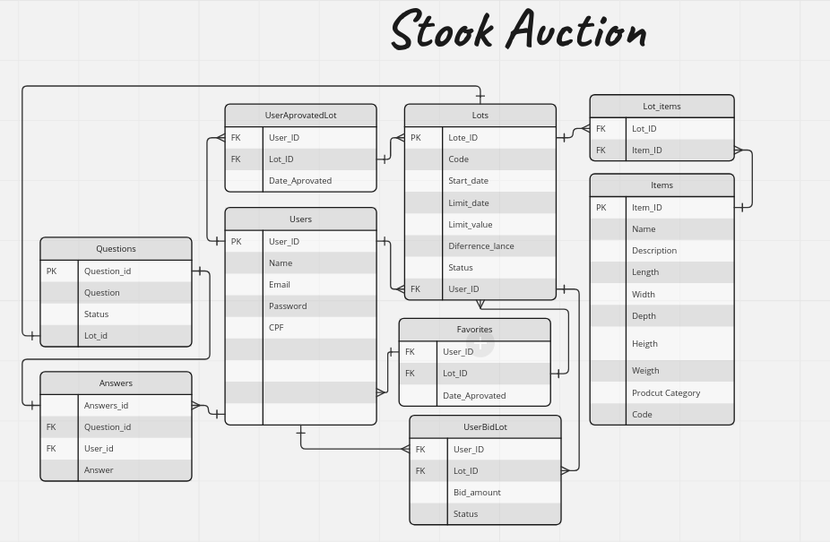

# README
 
# Sistema de Leilão 


Gerencie os itens de lotes de galpões com um sistema de leilão no qual possui dois usuários: 

Administradores: Que realizam o cadastro de produtos que estão disponíveis para venda, pela gestão do leilão incluindo a configuração de lotes, datas e lances mínimos e acompanhar os  pedidos recebidos para aprovação.

Usuários regulares: Podem criar uma conta na aplicação, buscar por produtos, ver detalhes de produtos e fazer um lance caso ainda seja possível.

## Links externos do projeto: 

Utilizado o site Miro para criação de um fluxograma de dados:
 https://miro.com/app/board/uXjVMM-4BoM=/?share_link_id=338248357384

Utilizado o site Trello para organização das tarefas e ideias que surgiram durante o projeto:
 https://trello.com/invite/b/3ttLgPSY/ATTIb2be55cf15129a3b66bfc219817a16e223059A20/tarefas-do-projeto-de-leilao

## Modelagem do banco de dados: 



## Requisitos necessários

Ruby 3.1.2 ou Superior

SQL Lite 1.4 ou Superior

Rails 7.0.4.3 ou Superior

## Executar o projeto:
Certifique de possuir instalado em sua máquina:

git
```terminal
  sudo apt install git
```
ruby > 3.1.2p20 :
```terminal
  sudo apt-get update
  sudo apt install ruby-full
  ruby -v 
```

rails > -v 7.0.4.3: 
``` terminal
 gem install rails   
 rails -v
```

Clone o repositório em sua máquina:
``` terminal
git clone https://github.com/MatheusOB21/stock-auction
```

Instale as dependências:
``` terminal
cd stock-auction
bundle install
```

Configure o Banco de Dados:
``` terminal
rails db:migrate
```

Popule sua aplicação:
``` terminal
rails db:seed
```

Execute aplicação: 
``` terminal
rails server
```
## Aplicação

Ao popular a aplicação, ficará disponivél para uso os seguinte usuários: 

### Administradores:

Email: jose@leilaodogalpao.com.br

Senha: jose123456789

Email: leandro@leilaodogalpao.com.br

Senha: leandro123456789

Email: rose@leilaodogalpao.com.br

Senha: rose123456789

### Regulares:

Email: flavio@gmail.com.br

Senha: flavio123456789

Email: juliana@gmail.com.br

Senha: juliana123456789

Email: marcos@gmail.com.br

Senha: marcos123456789


Também ficará disponível lotes e itens já pré cadastrados para uso. Entre eles os seguintes:

- Lotes pendentes de aprovação
- Lotes em andamento
- Lotes já finalizados
- Pergunta já feitas pela comunidade


## Funcionalidades:
- Usuários Administradores - Concluída

- Cadastro de Itens para Leilão - Concluída

- Configuração de Lotes - Concluída

- Visualizar Lotes - Concluída

- Fazendo Lances - Concluída

- Validando Resultados - Concluída

- Verificando Lotes Vencidos - Concluída

- Dúvidas sobre um lote - Concluída

- Bloqueio de CPFs - Pendente

- Lotes Favoritos - Concluída

- Busca de Produtos - Em andamento(atualmente apenas busca por parte do código do lote)
